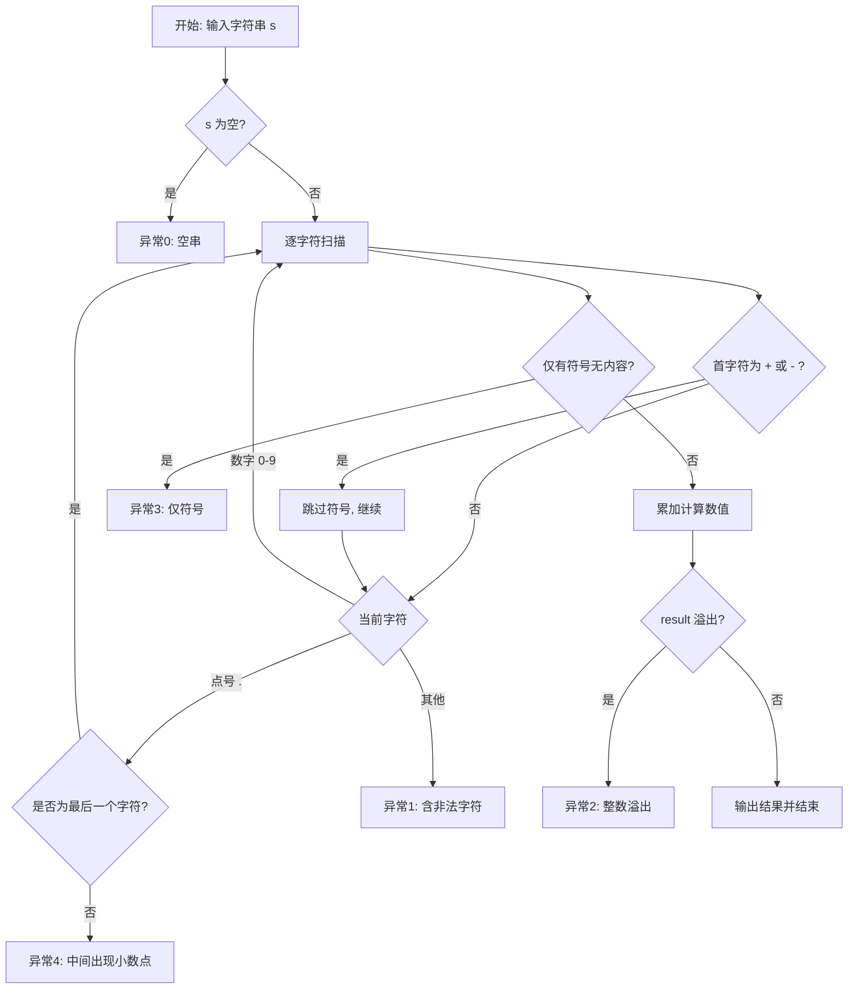

## 一、模型部分：整数格式判定分析

### 1.1 问题描述

本程序从标准输入读取一个字符串，判断其是否符合约定的**整数（可含符号、末尾小数点）**表示形式；若符合则转换为 `int` 并输出，若不符合则通过异常机制输出错误信息到标准错误流。

目标类型为 **32 位有符号整数**（`int`），有效范围约为 [-2147483648, 2147483647]。

### 1.2 合法格式定义

在满足下列规则时，称字符串**符合**整数表示格式：

| 规则编号 | 内容 |
|---------|------|
| R1 | 字符串非空 |
| R2 | 首字符可为可选的 `+` 或 `-`，且最多一个符号 |
| R3 | 符号之后至少有一个有效字符（数字或末尾小数点） |
| R4 | 其余字符均为数字 `0`～`9`，或**至多一个** `.`，且 `.` 只能出现在**最后一个字符**位置 |
| R5 | 按十进制累加得到的数值在 `int` 可表示范围内（不溢出） |

**合法示例**：`123`、`-456`、`+78`、`99.`（末尾小数点被忽略，按整数部分解析）

**非法示例**：`""`、`"-"`、`12.34`、`12a3`、`2147483648`

### 1.3 判定流程

#### 流程图

#### 字符级结构示意

合法结构（BNF）: [ +/- ] 数字... [可选末尾点]

非法示例: 空串、仅符号、--1、12.3、12a、超长数字

### 1.4 不符合整数格式的各类原因（异常分类）

| 异常码 | 类别名称 | 违反的规则 | 说明 |
|--------|----------|------------|------|
| 0 | 空字符串 | R1 | 输入长度为 0 |
| 1 | 含非法字符 | R2、R4 | 字母、空格、多符号等 |
| 2 | 整数溢出 | R5 | 超出 int 上界 |
| 3 | 仅有符号 | R3 | 仅为 + 或 - |
| 4 | 小数点位置错误 | R4 | . 不在末尾 |

### 1.5 设计要点

- 符号仅首字符一次；负数递归取反。
- 末尾点如 123. 按 123 解析。
- 异常信息输出到 cerr。

---

## 二、验证部分

### 2.1 测试方法

1. 编译运行 2. 输入测试串 3. 记录 stdout/stderr 4. 比对预期 5. 五类异常各一例+合法回归

### 2.2 测试报告

| 编号 | 目的 | 输入 | stdout | stderr |
|------|------|------|-------------|-------------|
| TC-01 | 异常0 | "" | — | String is empty |
| TC-02 | 异常1 | 12a34 | — | String contains non-digit characters |
| TC-03 | 异常2 | 2147483648 | — | Integer overflow |
| TC-04 | 异常3 | - | — | String has only one sign |
| TC-05 | 异常4 | 12.34 | — | String has a dot in the middle |
| TC-06 | 合法 | 12345 | 12345 | 无 |
| TC-07 | 合法 | -42 | -42 | 无 |
| TC-08 | 合法 | +7 | 7 | 无 |
| TC-09 | 合法 | 99. | 99 | 无 |
| TC-10 | 合法 | 0 | 0 | 无 |

